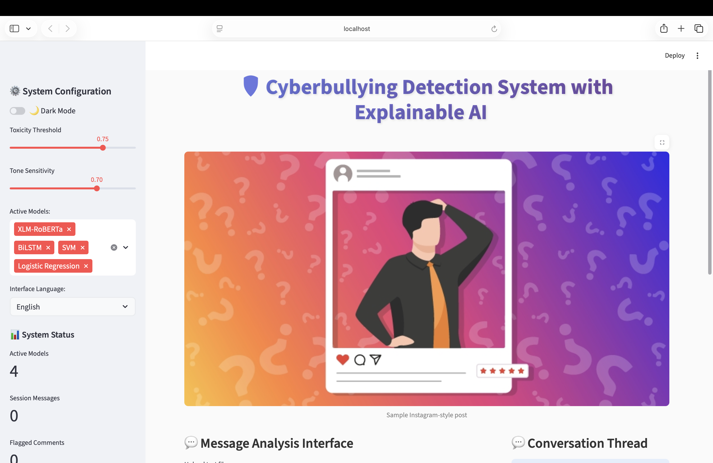
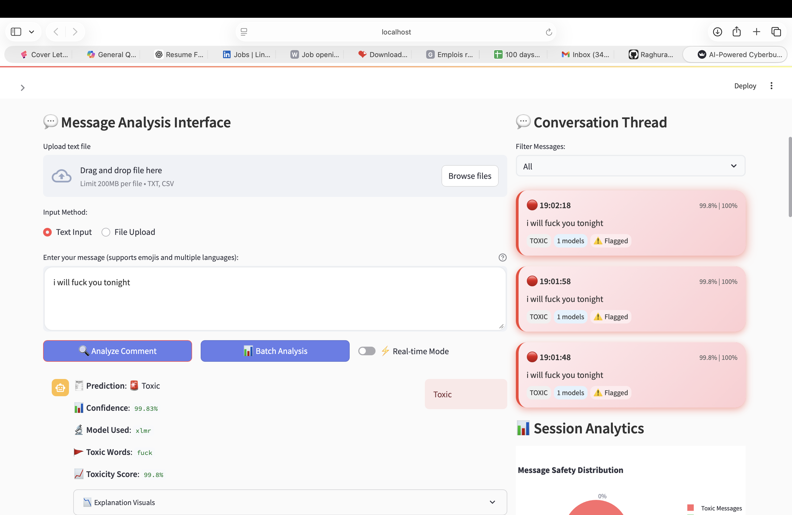
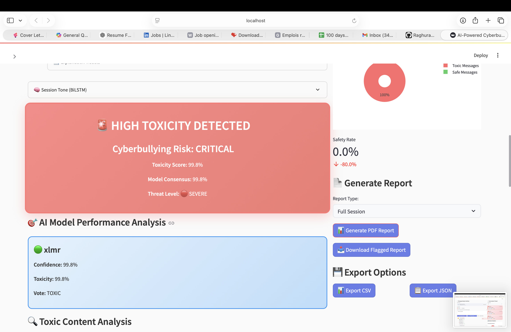

# 🛡️ Cyberbullying Detection Using Explainable AI

## 📌 Overview

Cyberbullying on social media platforms is increasing rapidly, making manual moderation difficult and time-consuming.

This project presents a multilingual cyberbullying detection system built using machine learning and transformer-based models, enhanced with Explainable AI (XAI) techniques to ensure transparency in predictions.

The system not only detects toxic content but also explains why a message is classified as toxic or non-toxic.  
An interactive Streamlit web application allows real-time testing and visualization.

---

## 🎯 Objectives

- Build a cyberbullying detection system using ML and transformer models  
- Integrate Explainable AI techniques (SHAP, LIME, Attention)  
- Support multilingual and emoji-rich text  
- Perform single-message, batch, and session-based analysis  
- Develop a user-friendly Streamlit web interface  

---

## 📊 Dataset

This project combines multiple publicly available datasets:

- Jigsaw Toxic Comment Classification Dataset  
- Emoji-rich tweet datasets  
- Multilingual cyberbullying datasets  
- Synthetic and conversational cyberbullying samples  

### Data Characteristics

- Single-message classification samples  
- Conversation-level examples for contextual analysis  
- Multilingual content  
- Emoji-inclusive text  

### Preprocessing Steps

- Text normalization  
- Lowercasing  
- Tokenization  
- Stopword removal  
- Emoji handling  
- Multilingual encoding  

---

## 🧠 Models & Approach

### Transformer Model
- XLM-RoBERTa (Multilingual transformer-based model)

### Traditional & Deep Learning Models
- Logistic Regression  
- Support Vector Machine (SVM)  
- BiLSTM  

Transformer-based models showed better contextual understanding compared to traditional ML models.

---

## 🔍 Explainable AI Integration

To ensure transparency and avoid black-box predictions, the system integrates:

- SHAP – Highlights token importance  
- LIME – Provides local explanation of predictions  
- Attention visualization – Displays word importance in deep learning models  

These techniques allow users to understand why a message is flagged as toxic.

---

## 🚀 Key Features

- Multilingual text support  
- Real-time toxicity prediction  
- Confidence score display  
- SHAP & LIME visualizations  
- Session-based conversation analysis  
- Batch CSV upload  
- Downloadable results  
- Interactive Streamlit dashboard  

---

## 📂 Project Structure

```
Cyberbullying-Detection-Using-Explainable-AI/
│
├── app.py                    # Main Streamlit application  
├── pipeline/                 # Text processing and model inference  
├── models/                   # Trained model files  
├── components/               # UI components  
├── explainability/           # SHAP, LIME, attention modules  
├── data/                     # Datasets  
├── requirements.txt          # Dependencies  
└── README.md                 # Documentation  
```

---

## 💻 Installation

### 1. Clone the repository

```
git clone https://github.com/Hemanth-imandi/Cyberbullying-Detection-Using-Explainable-AI.git
cd Cyberbullying-Detection-Using-Explainable-AI
pip install -r requirements.txt
```

### 2. Run the application

```
streamlit run app.py
```

---

## 🌐 Web Application

Add your Streamlit screenshots inside an `assets` folder and include them like this:

```



```

---

## 📈 Model Performance

Performance varies depending on dataset and model type.

- Transformer models outperform traditional ML models  
- Session-based analysis improves contextual detection  
- Explainable AI improves interpretability and trust  

(Add actual accuracy / F1 score values here if available.)

---

## 📚 References

- Mahmud et al., 2023 — Cyberbullying prevalence study  
- Philipo et al., 2024 — Transformer model performance  
- Yi and Zubiaga, 2022 — Session-based detection  
- Maity et al., 2024 — Explainability methods  
- El Koshiry et al., 2024 — Advances in explainable models  

---

## 👥 Team Members

- Raghuram Munagala  
- HemanthvenkatadurgaSai Surendra Babu Imandi  
- Jayaram Prakash Navudu  
- Bhargavi Akula  
