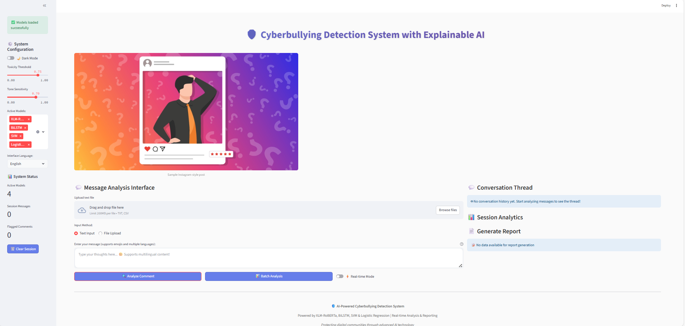

# Cyberbullying Detection Using Explainable AI

## Overview

Cyberbullying on social media is increasing, and manual moderation is difficult and time-consuming.
This project focuses on detecting cyberbullying text using machine learning models and providing explanations for each prediction using Explainable AI (XAI) techniques.

The system supports multilingual input and offers a Streamlit web interface where users can test messages, view predictions, and understand why a message is classified as toxic or non-toxic.

## Objectives

- Build a cyberbullying detection system using ML and deep learning models
- Provide explainability using SHAP, LIME, and attention visualization
- Support multilingual text and emoji-based content
- Perform both single-message and session-based analysis
- Create a simple Streamlit web application for interaction

## Dataset

This project uses a combination of public datasets such as:

- Jigsaw Toxic Comment Classification Dataset
- Emoji-rich tweet datasets
- Synthetic and conversational cyberbullying samples
- Multilingual cyberbullying datasets

The dataset contains both single messages and conversation-level examples.

## Approach

- Transformer-based model: XLM-RoBERTa
- Traditional ML models: Logistic Regression, SVM, BiLSTM
- Explainable AI methods to highlight important words
- Streamlit UI for predictions and visualizatio

## Features

- **Multilingual text support**
- **Real-time cyberbullying prediction**
- **Explainability visualizations**
- **Session-based conversation analysis**
- **Batch CSV upload**
- **Downloadable results**

## Project Structure

```
cyberbullying-detection/
├── app.py                    # Main Streamlit application
├── pipeline/                 # Text processing and model inference
├── models/                   # Pretrained and trained model files
├── components/               # Modular UI components
├── explainability/           # SHAP, LIME, and attention visualization
├── data/                     # Raw and processed datasets
├── requirements.txt          # Python dependencies
└── README.md                # Project documentation
```

## Installation

1. **Clone the repository**
   ```bash
   git clone https://github.com/your-username/cyberbullying-detection.git
   cd cyberbullying-detection
   pip install -r requirements.txt
   ```

2. **Run Application**
   ```bash
   streamlit run app.py
   ```

## Web Application



## Usage

1. **Single Text Analysis:**
   - Enter text in the input field
   - View toxicity predictions and confidence scores
   - Explore explainable AI visualizations

2. **Batch Processing:**
   - Upload CSV files for bulk analysis
   - Download processed results with explanations

3. **Session Analysis:**
   - Analyze conversation threads for context-aware detection
   - Track toxicity patterns across message exchanges

## Model Performance

Performance varies by dataset and model.
Transformer models generally perform better than traditional ML models.

## Explainability Features

- **SHAP token importance**
- **LIME explanations**
- **Attention visualization**

## References

- Mahmud et al., 2023 — Cyberbullying prevalence study
- Philipo et al., 2024 — Transformer model performance
- Yi and Zubiaga, 2022 — Session-based detection research
- Maity et al., 2024 — Sentiment and explainability methods
- El Koshiry et al., 2024 — Advances in explainable models

## Team Members

1. Raghuram Munagala
2. HemanthvenkatadurgaSai Surendra Babu Imandi
3. Jayaram Prakash Navudu
4. Bhargavi Akula


---

**Note: Developed as part of academic project work. Thank you for exploring this cyberbullying detection system.**